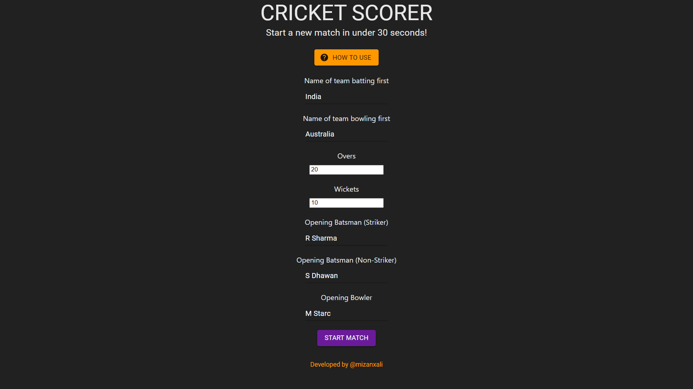
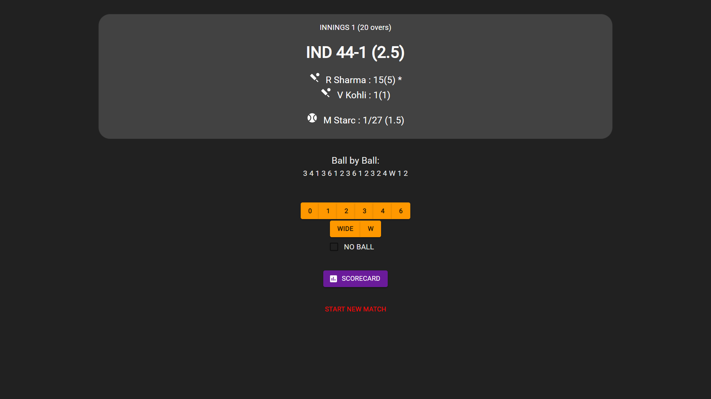
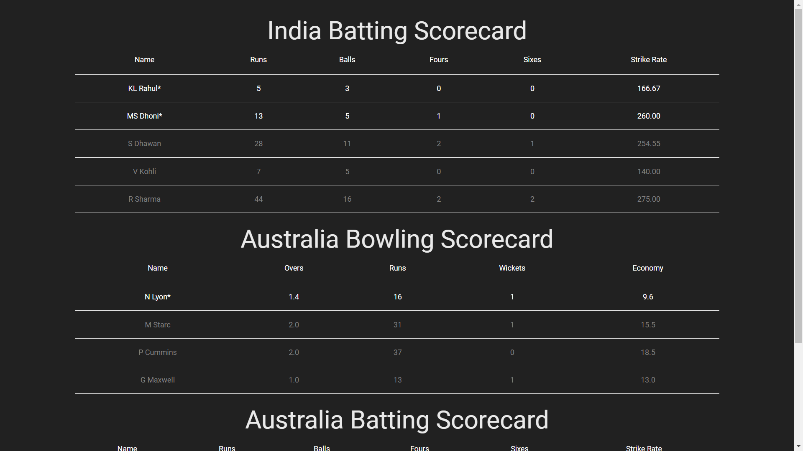

# Cricket Scorer
Front-end web app to keep score of cricket matches. Includes real time batting and bowling scorecard for each team.
Made with React, Redux, and Material UI.

## How I made this app
I paired up React with Material-UI to make the UI of the app and used Redux for complex state management. I wrote algorithms from scratch to maintain the game state data which changes after every ball. This included individual scores of batsmen and bowlers and also abstract information such as strike rotation and retention. I also added edge cases like wide balls and no-balls.

## How to use
Enter the starting info on the homepage and click on START MATCH to start a new match with the entered details. You will be redirect to the match page.
Enter outcome of each ball of the match by clicking on the appropriate buttons.
Click on SCORECARD to view the detailed batting and bowling scorecards, updated in real time after every ball.

